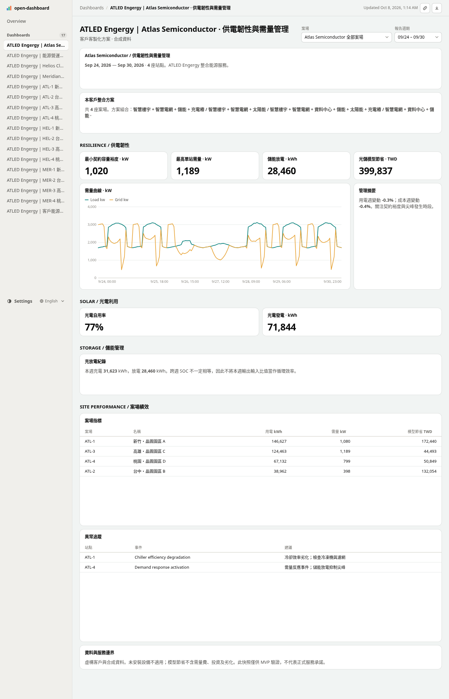

# ATLED Engergy · snapreport MVP

以 DuckDB 與 open-dashboard 0.7.0 建立企業能源營運 dashboard、離線週報與可稽核快照。虛構企業整合智慧樓宇、電網、資料中心、儲能、太陽能及充電樁。**所有資料與效益都是合成／模型估算。**

## 直接查看成品

[開啟 ATLED Engergy 展示網站](https://clarencechien.github.io/odsh/)

GitHub Pages 已啟用，可直接使用上方連結。

網站成品已準備在 `gh-pages` 分支，包含三家客戶的 dashboard、週報、六案場頁面與嵌入範例。工作區檔案連結與 GitHub 上的 HTML 原始檔不會直接呈現網頁，請使用 GitHub Pages。

部署設定：[Settings → Pages](https://github.com/clarencechien/odsh/settings/pages) 使用 `Deploy from a branch`、`gh-pages`、`/ (root)`。設定相同時，Save 灰色表示沒有新變更，不需要重新儲存。

以下是實際瀏覽器截圖，GitHub README 現在即可查看：



[物流客戶畫面](docs/screenshots/meridian.png) · [雲端客戶畫面](docs/screenshots/helios.png) · [決策週報畫面](docs/screenshots/report.png)

更新展示站：`npm run demo && npm run pages:publish`。發布器只接受明確標示的合成資料，保留既有網站分支歷史，不會上傳原始 Parquet、憑證或服務日誌。正式客戶資料仍走私有 Silo，不能使用這個公開 demo 發布流程。

## Energy Loop 新版

以 `#0087dc` 為主色，搭配青色與萊姆綠。每個頁面頂端可直接切換 Dashboard 與 Report。

| 客戶 | 兩個案場 | Dashboard 重點 |
|---|---|---|
| Atlas Semiconductor | 新竹製程微電網、台中智慧研發樓 | Sankey 能源流向、契約需量、樓宇負載熱圖、儲能 SOC |
| Meridian Logistics | 桃園電動車隊基地、高雄冷鏈補能站 | 充電熱圖、服務可用率、設備狀態時間軸、調度 |
| Helios Cloud | 新竹 AI 算力中心、台中綠能邊緣機房 | 溫度／PUE 散點、IT／非 IT 能耗拆解、備援儲能 |

週報使用不同閱讀版面：SQL 驅動的管理結論、光儲成本瀑布、逐站前後週比較，以及附責任動作的事件清單。接口卡呈現 BACnet、Modbus、OCPP、SunSpec、Redfish 的整合規劃，皆為模擬接口。

[查看決策週報範例](https://clarencechien.github.io/odsh/helios/report.html) · [查看營運 Dashboard](https://clarencechien.github.io/odsh/helios/dashboard.html)

## 已實作

- 三家客戶、六個案場，每個案場有不同整合設備組合。
- 三套客戶版型：Atlas 的需量／韌性、Meridian 的補能／光電、Helios 的算力／PUE／排放；六個案場專屬頁面。
- 內部 run 共十一個 dashboard；每個客戶獨立 run 共五頁（總覽、週報、客戶版型、兩個案場）。Dashboard 可離線切換預先計算的篩選；Report 固定週期，以管理摘要、效益拆解及行動清單呈現。
- 季度十五分鐘資料、五個已知異常／需求反應事件、物理守恆與品質檢查。
- snapshot manifest、輸入與產物 SHA-256、兩次重建資料 hash 一致、敘事數字 lint、有界修復 callback、失敗報告。
- 編輯式／原生主題、React 與 Vue iframe demo、純靜態 runs 索引。
- **PGSTY Silo** 真實 S3 發布，每客戶私有 bucket、回讀 checksum、不可覆寫 release、受限本機讀取 gateway。
- Rill 可攜 Parquet 專案、interval-level metrics 與 query-comment 衍生草稿；ClickHouse 接入介面與設定範例。

## 快速開始

需求：Node ≥ 22.18（已測 24.19）、npm、瀏覽器；Silo demo 需要 Docker。套件精確版本由 package-lock.json 固定。

```bash
npm ci
npm run demo                    # 產生資料、四個 run、靜態站、HTML、Rill 專案
npm run serve                   # 本機產物入口，port 4173
npm run dev                     # DuckDB 動態開發模式，port 5473
```

`npm run demo` 預設產生 `demo-2026-q3-v3` 與三份客戶 run。既有 run 會保留輸入；若模板或輸入變動，build 會拒絕覆寫，請用新的 `ATLED_RUN_SUFFIX`（例如 `-v4`）。每次週報都應建立新的 run。

```bash
node src/cli.mjs generate atlas-new --tenant 'Atlas Semiconductor' --seed 42 --days 92
node src/cli.mjs build atlas-new
node src/cli.mjs verify atlas-new
node src/cli.mjs export-rill atlas-new
```

主要產物位於 `runs/<run_id>/build/`：

| 路徑 | 用途 |
|---|---|
| `report.html` | 套用 editorial CSS 的單檔週報 |
| `report-native.html` | 同資料／版面，保留品牌導覽但不套 editorial CSS 的版本 |
| `dashboard.html` | 單檔客戶營運 dashboard；內部 run 為總覽 |
| `site/` | 多頁靜態站，客戶與案場頁面在 `d/<id>/` |
| `demos/react/`、`demos/vue/` | 完整本地 bundle 的 iframe 宿主 |
| `manifest.json` | 輸入列數、hash、模板指紋、query 執行數、截斷警告與產物 checksum |
| `check.json`、`lint.json` | renderer 與敘事驗證結果 |

靜態站需由 HTTP server 提供 JSON/JS/CSS。單檔 HTML 不需要伺服器；本環境 Chromium 的管理政策禁止直接 `file://` 導航，驗證採關網後將完整 HTML 載入頁面，並實測零網路請求與篩選。

## PGSTY Silo

```bash
npm run silo:start
node src/cli.mjs publish-silo atlas-2026-q3-v3
node src/cli.mjs publish-silo meridian-2026-q3-v3
node src/cli.mjs publish-silo helios-2026-q3-v3
node src/cli.mjs serve-silo atlas       # port 4174，讀取真正 Silo 物件
```

使用官方 `pgsty/silo` 的 `RELEASE.2026-09-03T13-18-01Z`，固定 image digest。開發憑證首次啟動時隨機產生，只存在忽略版控且權限受限的 `.runtime/silo.env`；不會嵌入 HTML。Silo 資料保存在 Docker volume `atled-silo-data`。停止服務使用 `docker stop atled-silo-dev`；重新執行啟動命令會復用資料。

每客戶獨立 bucket：`atled-atlas`、`atled-meridian`、`atled-helios`。發布前先驗證 manifest，上傳後逐一讀回驗證 hash，最後寫入 release commit marker。發布未完成的 run 不會由 gateway 提供。相同 release 可重試，已完成且內容不同的同名 run 會被拒絕。MVP 發布器為單寫入者設計，尚無跨程序 compare-and-swap／WORM retention。

外部 Silo 使用 `SILO_ENDPOINT`、`SILO_ACCESS_KEY`、`SILO_SECRET_KEY`，遠端必須 HTTPS。本機 gateway 是開發工具，綁定 loopback 且不含登入；正式客戶入口應由既有服務提供認證及 bucket 權限控管。不要將內部跨客戶 run 對外分享。`.runtime/releases/` 是上傳 staging，**不是 Silo 的替代實作**。

## 客製化與資料來源

- `src/customers.mjs`：客戶 KPI 偏好及逐站整合方案。
- `src/layouts.mjs`：輸出原生 open-dashboard TSX/SQL 的三套版型，依設備能力裁切面板。
- `dashboards/energy/`、`dashboards/weekly/`：共用總覽及週報模板。
- `databases/energy/database.md`：欄位、單位、時間、估算與加總語意，寫 SQL 前必讀。
- `open-dashboard.config.ts`：DuckDB views；固定單執行緒以確保浮點彙總的可重現性。
- `adapters/`：ClickHouse HTTP SELECT 邊界與原生 datasource 範例。未宣稱連上真實 ClickHouse；目前 SQL 使用 DuckDB 方言。

動態開發模式會重跑 DuckDB SQL；交付 Dashboard 是凍結查詢結果，可切有限個站點／觀測週期；Report 固定報告範圍以便引用與列印。這不是即時串流 BI。Rill 定位為後續自由探索層，不把任意查詢引擎塞入報告。`runs/<id>/rill/` 可用 `rill start .`；本次驗證 YAML、來源檔案與七個指標 SQL，未啟動 Rill runtime／Cloud。

## 驗證

```bash
npm test                        # 18 個單元／整合測試；生成器、真 DuckDB、實際 renderer 錯誤等
npm run typecheck
npm run test:e2e                 # 先 npm run demo；Chromium 離線篩選、版型、iframe、手機、隔離
npm run test:themes              # 三家客戶深淺色、手動主題覆寫、文字對比與列印
npm run test:pages               # /odsh/ 部署路徑、連結、篩選與嵌入
npm run test:snapshots           # 能源流向守恆、成本橋接與差異化事件
npm run test:services            # 先啟動 Silo 並發布三家；Silo 回讀、gateway、Rill SQL、動態 API
```

Linux 的預設 Chromium 為 `/usr/bin/chromium`，可用 `CHROMIUM_PATH` 指定已安裝瀏覽器。`test-results/` 包含檢查 JSON 與 screenshots。完整結果、里程碑邊界見 [docs/validation.md](docs/validation.md)。

## 有界 agent 迴圈

`src/lint.mjs` 的 `boundedValidation(validate, repair, maxAttempts)` 接受外部 agent 提供的修復 callback，最多三次驗證；成功或修復沒有變動就停止。`check` 可接此 callback，保留每次結果。預設 CLI 不連線 LLM、不猜改 SQL，因此只檢查一次並回報可供 agent 使用的行號。此上限與失敗歷史已用測試驗證。

開發時修改 repo 內模板，使用新 run 重建。不要把 `runs/<id>/workspace/` 的臨時編輯誤認成已更新模板。每個雲端任務已有隔離 checkout，不需額外建立 Git worktree。
