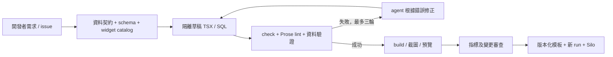
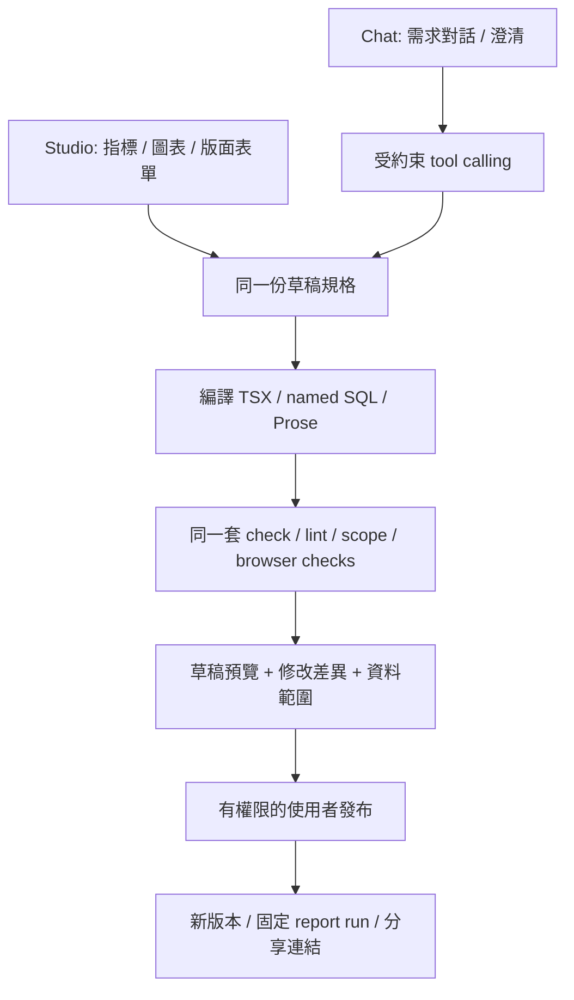

# Agent 產製與客戶 Studio / Chat 路線圖

更新：2026-10-08（Asia/Taipei）。**本文是可實作的設計，不是已上線的服務／API 清單。** 對外科普版見 [open-dashboard-guide.html](open-dashboard-guide.html)，接手操作見 [../handoff.md](../handoff.md)。

## 1. 結論與分工

兩條路都可做，並可共用同一條產製流水線：

- **Dev + agent tools**：開發者描述目標，agent 在隔離草稿中建立／修正 TSX、SQL、widget，再做檢查、預覽、版本審查與發布。最接近現有 repo，可先落地。
- **Customer + Studio / chat UI**：客戶選指標／設備／版型，或用自然語言描述；兩種入口都產生同一份受約束的草稿，後端編譯成 TSX/SQL，通過同樣驗證後預覽與發布。

前者允許開發者擴充 widget 的實作；後者第一版只組合已註冊的 widget 與指標。新的繪圖程式或資料連接器先進開發流程，再成為客戶可用選項。**調整既有 widget 的位置，不等於生成新的 widget/query。**

## 2. 原生 open-dashboard 的 agent 能力與限制

以本 repo 鎖定的 0.7.0 為準：

| 能力 | 已確認的原生行為 | 本 repo 狀態 |
|---|---|---|
| TSX + named SQL | 輸入可由 agent 編輯、版本控管與 diff | 已用於全部版型 |
| schema / query / charts | CLI 可查看欄位、查只讀資料、列出圖表 | 可執行；agent 可由 shell 呼叫 |
| check --json / render | 查詢與欄位檢查；Playwright 截圖 | 已整合 check，另有自己的 browser tests |
| build / exportHtml | 靜態站／單檔快照 | 已整合 manifest、正規化及租戶交付 |
| 原生 Edit | 透過 dev API 修改 workspace 的 TSX | 引擎具備；尚未建立可交付的多人 authoring 服務 |
| MCP | CLI 有 stdio / dev HTTP 入口，需額外 `@open-dashboard/mcp` | 未安裝、未驗證，不是現成可用的 repo 工具 |
| 可選 dashboard assistant | `read_panels` 讀面板；`set_filters` 切有效篩選；答案根據頁面資料 | 未配置模型；不是生成 TSX/SQL 的 authoring agent |

原生的 schema/check 等能力能降低 agent 亂猜的機率，但 `check` 成功只代表部分結構／查詢可用，不證明 KPI 語意、租戶範圍、敘事因果與視覺品質都正確。這也是 repo 增加資料契約、Prose lint、品質與瀏覽器驗證的原因。

## 3. 路徑 A：開發者用 agent 產製固定內容



### 現在就能怎麼串

開發 agent 可先直接執行本 repo CLI，不必先加 MCP：讀 `database.md` → 查 schema / query → 修改 `src/layouts.mjs` 或 TSX/SQL → 新 run check/build/verify → 看截圖。`handoff.md` 提供精確路徑。

下一步應加 **job runner**，把這些步驟包成可追蹤的任務。runner 不重新發明 renderer，也不要求 agent 直接改 node_modules。需有獨立草稿目錄，避免 `prepareWorkspace()` 在修復迴圈中把修改覆蓋。

### 建議 tools 契約（尚未實作）

| Tool | 輸入／輸出 | 對應現有能力 |
|---|---|---|
| `read_contract` | source → schema、欄位語意、粒度、指標清單 | database.md / native schema |
| `list_widgets` | scope → 已允許元件與 props | native charts + 客戶設備能力 |
| `preview_metric` | metric_id、有效維度／期間 → 有界結果 | named query + DuckDB；非任意寫入 SQL |
| `create_draft` / `patch_draft` | draft revision、檔案變更 → 新 revision | 新增管理層，限定草稿路徑 |
| `validate_draft` | revision → findings、行號、品質結果 | check + lint + quality |
| `render_preview` | validated revision → screenshot、預覽 URL、artifact hashes | build/export + browser |
| `request_publish` | validated revision、preview hash → 發布候選 | 新增審查／發布流程 |

授權發布時重新核對 **同一份 revision/hash**，不能讓驗證後又被修改的內容直接發布。失敗輸出包含每輪 findings，不以重試遮掉錯誤。現有 `boundedValidation(validate, repair, 3)` 是基礎，但尚未實際呼叫模型與工具鏈。

## 4. 路徑 B：客戶用 Studio 或 chat 產製

Studio 與 chat 是兩個入口，不是兩套 renderer：



例：「替 Helios 做一張本週 PUE 與上週比較，分案場看。」

1. 登入服務判定可讀案場，回傳可用的 `pue` 指標與比較期間。
2. Chat 如有歧義，確認「PUE 要用能源加權，不是平均各站 PUE」；Studio 則用選單選同一個已審核指標。
3. 產生 draft，預覽顯示來源、期間、加總語意與樣本資料；不能把沒裝機的欄位猜成存在。
4. 編譯器選擇 `Stat + BulletChart` 或其他已註冊 widget，輸出普通 TSX/SQL，沿用 renderer。
5. 新增 Report 時選固定報告期間與敘事模板；數字經 SQL placeholders 注入，模型文字不得自行捏造數字。
6. 使用者檢視草稿後發布。已發布 Report 保持不變；Dashboard 的偏好與正式模板版本分開存。

### 草稿範例（提議格式，不是現有 API）

```json
{
  "schema_version": 1,
  "kind": "dashboard",
  "title": "算力能效比較",
  "template_revision": "energy-loop-base-1",
  "period": {"preset": "current_week_snapshot"},
  "widgets": [
    {"id": "pue-total", "type": "Stat", "metric_id": "pue", "compare": "previous_week", "span": 4},
    {"id": "pue-by-site", "type": "BulletChart", "metric_id": "pue", "group_by": ["site_id"], "span": 8}
  ]
}
```

租戶與有效站點由伺服器身分決定，不能相信 request body 的 tenant。`metric_id` 對應審核過的 SQL 生成器與相容 widget；`span` 等 layout 是偏好，不改資料授權。這個 JSON 是 **authoring UI 的輸入契約**，最終仍編譯到既有 TSX/SQL，不建立另一套執行時 dashboard DSL。

### 建議 API 與版本流程（全部尚未實作）

- `POST /api/drafts`：由 Studio/chat 建草稿，回 `draft_id/revision`。
- `PATCH /api/drafts/:id`：帶 expected revision；衝突回 409，保留兩人的改動。
- `POST /api/drafts/:id/validate`：建立 job，輸出 findings；不是同步等待整個 build。
- `GET /api/jobs/:id` 或 SSE：顯示 queued / building / failed / ready，失敗可回到 draft 修正。
- `GET /api/drafts/:id/preview`：回短效、租戶隔離的預覽，不公開未驗證內容。
- `POST /api/drafts/:id/publish`：核對角色、revision、已驗證 artifacts hash，生成不可變 release。
- `POST /api/chat/sessions/:id/messages`：模型只呼叫允許的 draft tools；以事件更新 Studio 的同一份草稿。

狀態：`draft → validating → preview_ready → published`，錯誤保留 `failed + findings`；修改後回到新 draft revision，舊 release 不被覆蓋。取消長任務停止 worker；重送相同 idempotency key 不產生重複 release。

## 5. 真正需要增加的服務

| 元件 | 責任 | 與現有 repo 的接點 |
|---|---|---|
| Studio / chat 前端 | 選指標、排版、顯示差異／進度與預覽 | 可沿用 Energy Loop，現有 personal editor 僅為原型參考 |
| Application API + auth | 使用者／客戶範圍、draft revision、發布權限 | 目前沒有；不可直接對外開放無登入 dev server |
| Draft / revision DB | 公司模板、個人偏好、job、操作紀錄 | 取代 localStorage 作為跨裝置來源；可先用 PostgreSQL 等 |
| Job queue + Node worker | 隔離 workspace、模型工具、DuckDB、驗證、build、browser render | 復用 src/build/lint/quality；固定依賴版本 |
| Model adapter | 模型供應商、工具呼叫、用量與任務限制 | 可接雲端模型或本地模型；密鑰只在 server |
| Object storage | 原始輸入、草稿預覽、immutable release | 優先延續 Silo；R2/S3 是可選儲存配置，不是改成任意公開 bucket |
| Live query / Rill | 更自由的分析與最新資料 | 獨立選配，與固定報告產製分開；目前只有匯出 |

先做一個可運作的 Node API＋worker＋DB，也可以先在同一部署內分模組；不必第一天拆成多套微服務。之後再按建置負載獨立 queue/worker。

## 6. 租戶與執行邊界是產品功能的一部分

Customer 不能取得任意 shell、任意 JS/TSX 執行與任意路徑寫入工具。第一版選用註冊元件；新增程式型 widget 走開發者審查。開發 agent 的程式草稿也在隔離 worker 執行，限制網路、時間、記憶體與資料範圍，讓預覽失敗不拖垮客戶入口。

Schema 檢查以外還要驗證 `metric_id` 與設備相容性、PUE/可用率分母、期間、租戶、輸出列數。自訂文字及資料值是內容，不是 agent 的新指令。Published artifact 不含 SQL、模型金鑰與 datasource 憑證；正式資料使用私有連結／授權 gateway。

個人偏好、公司共用模板、已發布報告是三種不同版本，分別儲存；rollback 選回已驗證版本，不覆寫歷史。

## 7. 部署選擇

- **現在**：GitHub Pages 提供靜態展示；本地 Node 提供 dev / DuckDB；本地 Docker 提供 Silo。
- **先看原生 Edit**：Node 容器／VM＋持久磁碟，先以隔離測試模板驗證，不把 dev 直接當正式多租戶服務。
- **Vercel / Cloudflare 路線**：可承載前端與輕 API；長時間 build、Playwright、native DuckDB 放獨立 Node worker。Vercel 的 ephemeral filesystem 不當正式模板資料庫；Workers 的 Node 相容層不等於支援本案 native addon。R2 存檔案、D1/Postgres 等存設定時仍需適配，不是搬檔即完成。
- **全地端**：前端／API／worker／資料庫／Silo 與模型皆在地端；若選雲端 LLM，就不再宣稱整條 authoring 流程全地端。

## 8. 建議分期與驗收

| 階段 | 交付 | 通過條件 |
|---|---|---|
| A：dev agent 閉環 | 一個 job runner、模型工具介面、有界修復與 failure report | 從一個需求產生新 widget/dashboard/report；錯誤在三輪內修復或停止；可重建、可追溯 |
| B：Studio 白名單 | 指標/元件目錄、同一 draft schema、preview/publish | 客戶不用寫 SQL 就能建立新頁；租戶隔離；儲存／取消／還原直覺；兩人同改有衝突處理 |
| C：chat authoring | conversation tools 與同一 draft API | chat 與 Studio 交替修改同一版本；解釋和生成模式可區分；不繞過驗證／發布權限 |
| D：探索與營運 | Rill runtime、資料刷新、公司模板、排程報告 | 加權指標一致；新資料產新 run；可監測／回復失敗工作；正式身份與交付驗收 |

先完成 A 的真實端到端任務，再做 B/C 的 UI。當前完成的是展示與產製基礎、有限個人排版、Rill 匯出；以上 API、客戶生成與多租戶 authoring 尚未實作。

## 9. 參考與查證範圍

- [open-dashboard 上游](https://github.com/simonliu-ai-product/open-dashboard)：本文件依鎖定 0.7.0 的 CLI help、`src/config.ts`、`src/ops/assistant.ts` 與 `src/app/lib/use-layout-edit.ts` 核對；未保證後續版本一致。
- [Rill](https://github.com/rilldata/rill)、[PGSTY Silo](https://github.com/pgsty/silo)。
- [實測紀錄](validation.md)、[架構](architecture.md)、[上游提案（未送出）](upstream-proposals.md)。
