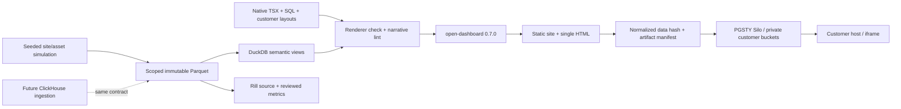

# Architecture and delivery boundaries

The shell uses open-dashboard's CLI and public `Workspace/loadConfig/exportHtml` boundary. It never imports internal React components or modifies the renderer. Prose is an official `defineChart` extension and uses escaped React text, including database values.

Build is staged and checked before replacing the prior build. Input/template fingerprints prevent semantic mutation of an already built run. File hashes cover complete bytes; `data_hash` covers all normalized `site/data` JSON, retaining row order and dropping only `ranAt` and `elapsedMs`. Site/single query payloads must match. Wall-clock HTML build timestamps are intentionally outside `data_hash`; byte-identical full HTML is not promised.

A default 92-day dataset contains 6 × 92 × 96 = 52,992 site intervals and 25 installed subsystem meters × 92 × 96 = 220,800 telemetry rows. The same seeded draws are used when selecting an individual tenant; scoped inputs are a reproducible subset of the portfolio. Each run stores five Parquet tables plus generation lineage.

Snapshot filter enumeration has a per-query cap of 100. The largest supported site × window product is 7 × 3 = 21 (including null defaults). The developer live API does not have this snapshot product restriction. Any build-time query error or row truncation is fatal; filter trimming is a manifest warning, and demo builds must have none.

Customer data is sliced before materialization and never relies on browser filters as authorization. Published report assets do not contain Parquet, SQL, runtime credentials or source workspaces. Silo uses private buckets. The development reader gateway is bound to loopback and can only read a specified tenant bucket and committed release artifacts. Production authentication, policies, backup/restore and TLS termination belong to the deploying host.

Rill's reviewed metrics calculate ratios from interval-level numerator/denominator sums. Query-derived draft metrics use MAX on already aggregated values as a deliberately conservative placeholder and are excluded with `.rillignore`; they are not valid automatic additive rollups. ClickHouse is an extension point with a tested HTTP adapter boundary, not a completed production connector or promised cross-dialect compatibility.

Energy Loop uses native chart widgets for operational exploration (Sankey, heatmap, gauge, bullet, scatter, timeline, line, bar and treemap). The fixed weekly report intentionally has no filters: SQL-derived prose, a cost waterfall, site comparison dumbbells and an action table. IntegrationMap is a second official defineChart extension describing mocked protocol seams. All six sites inherit only widgets supported by their installed domains.
